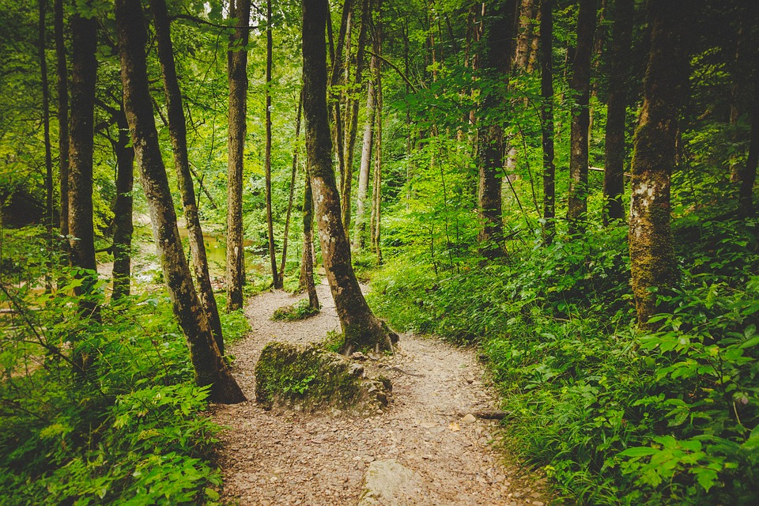
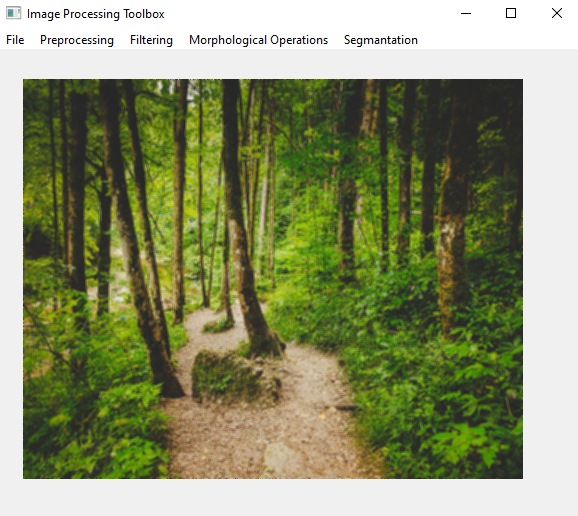
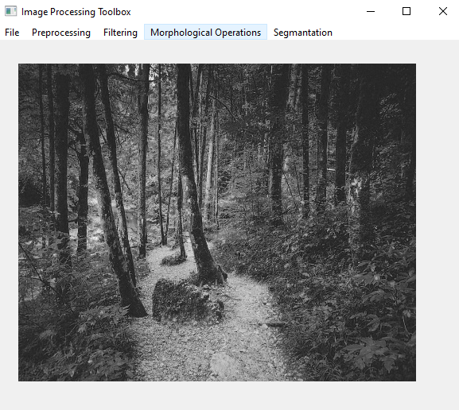
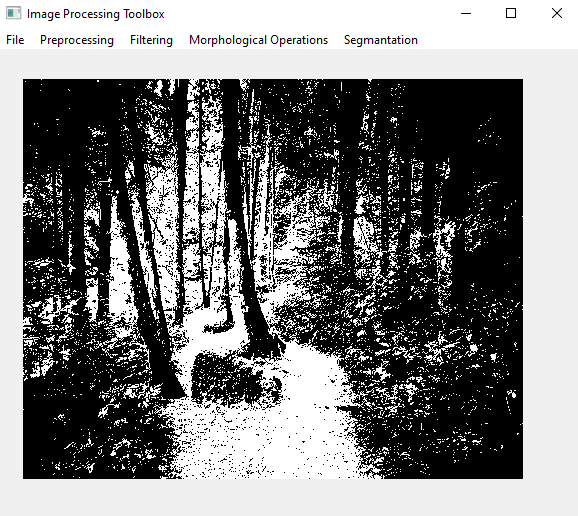

# Image Processing Software

This is one of my old projects. I did this for learning while taking "Image Processing" lesson. The mathematical operations that run in the background are written by me. You can do some operations preprocessing, filtering etc. to your image. Sometimes it can be useful but it has a performance issue.

Original Image

Mean Filter

Grayscale Transformation

Thresholding (Otsu)

